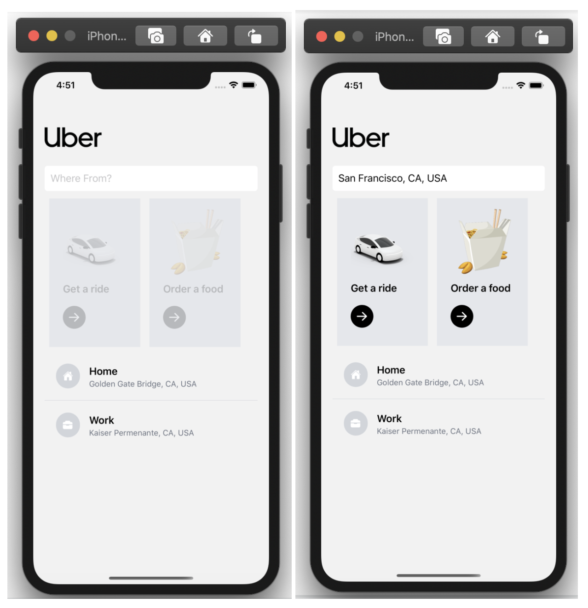
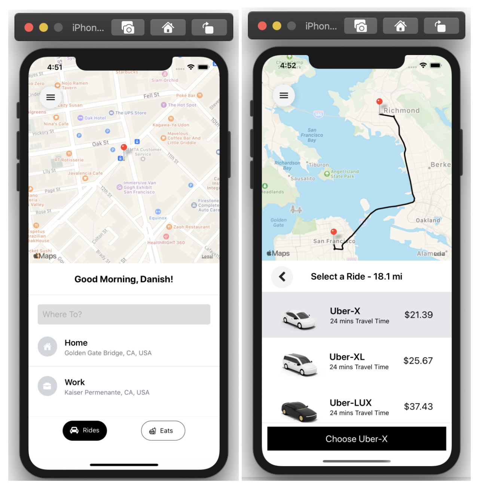

## uber-clone-react-native

Created an uber-clone using React Native that uses React Native Navigation, Google Maps API, Google Directions API, and Google Distance Matrix API.

## App ScreenShots

## Tech Stack: Expo App

React Native, Redux, Google Maps APIs.

